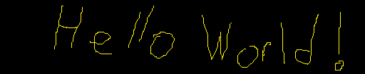

## Hi there 👋

 
<h1 align="center">Hello, I'm Ahmet Salih! 👋</h1>

<h3 align="center">I'm a computer engineering student. Welcome to my GitHub profile!</h3>

- 🌱 I’m currently learning **Java Spring and Python for Data Science**

- 🔭 I’m currently working on my projects

- 👨‍💻 All of my projects are available at **under construction**

- 📫 How to reach me **[salihasd99@gmail.com](mailto:salihasd99@gmail.com)**

<h3 align="left">📫 Connect with me:</h3>

<h3 align="left">⚡ Languages and Tools:</h3>

  
  
  
  
  
  
  
  
  
  
  

<h3 align="left">📊 Github Stats:</h3>

<table width="100%">
  <tr>
    <td>
        <a href="https://github.com/ahmeth-sd">
          <picture>
            <source media="(prefers-color-scheme: dark)" srcset="https://github-readme-stats-sigma-five.vercel.app/api?username=ahmeth-sd&theme=radical&hide_border=false&include_all_commits=true&count_private=true&show_icons=true" />
            <source media="(prefers-color-scheme: light)" srcset="https://github-readme-stats-sigma-five.vercel.app/api?username=ahmeth-sd&hide_border=false&include_all_commits=true&count_private=true&show_icons=true" />
            
          </picture>
        </a>
    </td>
    <td>
        <a href="https://github.com/ahmeth-sd">
          <picture>
            <source media="(prefers-color-scheme: dark)" srcset="https://github-readme-stats.vercel.app/api/top-langs/?username=ahmeth-sd&theme=radical&layout=compact" />
            <source media="(prefers-color-scheme: light)" srcset="https://github-readme-stats.vercel.app/api/top-langs/?username=ahmeth-sd" />
            
          </picture>
        </a>
    </td>
  </tr>
</table>

<!-- My Projects
Here are some of the projects I'm proud of:
[Project Name](Link to Project Repository) - Description of the project.
Feel free to explore more of my projects on [My Portfolio Website](Link to Portfolio) or [My GitHub Repositories](Link to GitHub Profile). -->

<!--
**ahmeth-sd/ahmeth-sd** is a ✨ _special_ ✨ repository because its `README.md` (this file) appears on your GitHub profile.

Here are some ideas to get you started:

- 🔭 I’m currently working on ...
- 🌱 I’m currently learning ...
- 👯 I’m looking to collaborate on ...
- 🤔 I’m looking for help with ...
- 💬 Ask me about ...
- 📫 How to reach me: ...
- 😄 Pronouns: ...
- ⚡ Fun fact: ...
-->
